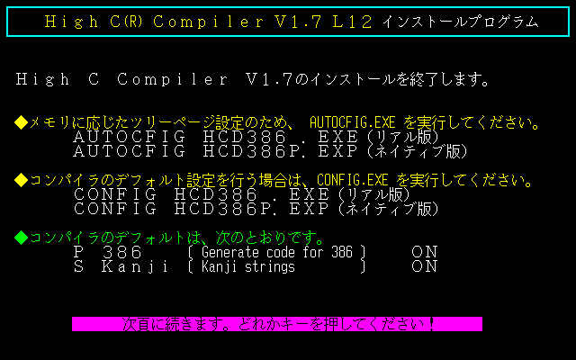

## Get

- CD-ROM
   - High C Compiler マルチメディア開発キット V1.7 L13 (High C Compiler Multimedia Development Kit V1.7L13)
      - comes with SoftProbe386X (source level debugger) and 386|LINK
   - High C Compiler マルチメディアキット V1.7 L12 (High C Compiler Multimedia Kit V1.7L12)
      - comes with TLINK
   - etc.

## Install to HDD

### Prerequisites

- [TownsOS V2.1 on DOS6](../os/tos-dos6.md)

### Install

1. Insert CD-ROM and double click 'インストール (install)' in 'HC386' gorup on TownsMENU
   - 
   - 
2. Installer starts
   - 
   - Common texts:
      - '確認〔改行〕 (confirm <kbd>⏎</kbd>)'
      - '取消〔後退〕 (cancel <kbd>BS</kbd>)'
      - '中断〔ESC〕 (abort <kbd>ESC</kbd>)'
3. Component selection
   - 
   - Common texts:
      - 'する〔←〕 (install this item <kbd>←</kbd>)'
      - 'しない〔→〕 (do not install this item <kbd>→</kbd>)'
   - Components:
      - 'High C Compilerのインストール (install High C Compiler)'
      - 'お使いになるコンパイラ／リンカタイプ (type of compiler/linker to use)'
         - 'リアル版 (real mode program, 16bit)'
            - *NOT recommended*
         - 'ネイティブ版 (native mode program, 32bit)
            - *recommended*
      - 'ユーティリティのインストール (install utility programs)
      - 'サンプルプログラムのインストール (install sample programs)
      - 'マニュアルファイルのインストール (install manual document files)
      - '各種ライブラリファイルのインストール' (install extra libraries)
      - '開発環境のインストール (install DEVELOP.SYS)'
         - *NOT recommended*
         - install hotkey driver to change screen mode for debugging
4. Installation
5. Update `AUTOEXEC.BAT` for `IPATH` environment variable
- 
- 
- Select boot drive containing `AUTOEXEC.BAT`
6. Finished
- 
- 

### Post-install settings

#### PATH

Append directory containing `HC386.EXE` to `PATH`.

If you installed High C Compiler to `D:\HC386`, append following line to your `AUTOEXEC.BAT` and reboot.
```
SET PATH=%PATH%;D:\HC386\BIN
```

##### Example


#### HC386.CNF

- `NATIVERUN` must set to 386|DOS-Extender command line
   - variable is set to `Q:\RUN386.EXE -nocrt`
   - change the drive letter to properly point `RUN386.EXE` on your boot drive
   - do not remove `-nocrt` option

##### Example


#### HC386SET.CNF

*This section is not neccesary if you installed 'High C Compiler マルチメディア開発キット V1.7**L13**'*

- Empty `TOOLSDIR` variable wrongly set to `q:\hc386\bin`
- Empty `USERLIBE` and `USERLIBC` variable wrongly pointing library files on `q:\hc386\townslib\lib`
   - or change `q:\hc386\townslib` to `d:\hc386\small` (if you installed High C Compiler to `d:\hc386`) to keep linking `tbios.lib` and `snd.lib` by default

##### Example


#### HCD386P.EXP

*This section is not neccesary if you installed 'High C Compiler マルチメディア開発キット V1.7**L13**'*

Header file search path `Q:\HC386\INC\;Q:\HC386\TOWNSLIB\INCLUDE\` referencing `Q:` drive is embedded in executable file.

Use `CONFIG.EXE` to remove this problematic setting.

##### Example

- Execute `D:\HC386\BIN\CONFIG.EXE D:\HC386\BIN\HCD386P.EXP`, then press <kbd>⏎</kbd> to continue
   - 
   - 
- Press <kbd>I</kbd>, <kbd>⏎</kbd>, <kbd>⏎</kbd> to empty the setting
   - 
- Press <kbd>⏎</kbd>, <kbd>Y</kbd>, <kbd>⏎</kbd> to save and exit
   - 


## Run

- `HC386.EXE`
   - compiler driver

### Example


