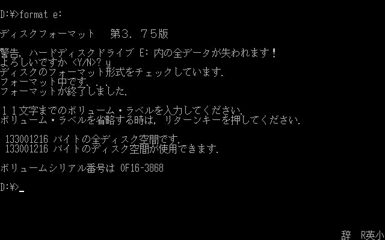

# MS-DOS 6

## Get

- 日本語MS-DOS V6.2 基本機能 (Japanese MS-DOS V6.2 Basic Functions)
   - 6x 3.5in FDs
- Master CD Freshシリーズ用
   - 6x FD image files:
      - disk 1: `\FD_IMG\DOS6FD1`
      - disk 2: `\FD_IMG\DOS6FD2`
      - disk 3: `\FD_IMG\DOS6FD3`
      - disk 4: `\FD_IMG\DOS6FD4`
      - disk 5: `\FD_IMG\DOS6FD5`
      - disk 6: `\FD_IMG\DOS6FD6`

## Prerequisites

- HDD (with SCSI ID 0-4)
- 'Important settings' in [CMOS](../etc/cmos.md)

## Install

### SETUP2.EXE

1. Boot from FD labeled 'ディスク1 (disk 1)'
2. `SETUP.EXE` starts automatically
   - Press <kbd>PF3</kbd>, <kbd>Y</kbd> to exit
3. Start `SETUP2.EXE` manually
   - Key bindings
      - <kbd>PF3</kbd>: save and back (save and exit on top menu)
      - <kbd>ESC</kbd>: discard and back, cancel
      - <kbd>↑</kbd>, <kbd>↓</kbd>, <kbd>←</kbd>, <kbd>→</kbd>: move cursor
      - <kbd>SHIFT</kbd>+<kbd>↑</kbd>, <kbd>↓</kbd>, <kbd>←</kbd>, <kbd>→</kbd>: move category
      - <kbd>⏎</kbd>: select item
      - for disk partiton and memory size selection:
         - <kbd>←</kbd>, <kbd>→</kbd>: change value
         - <kbd>SHIFT</kbd>+<kbd>←</kbd>, <kbd>→</kbd>: change value (faster)
         - <kbd>CTRL</kbd>+<kbd>←</kbd>, <kbd>→</kbd>: change value (fastest)

#### Memory Settings

- Select '拡張/増設メモリ (extended/expanded memory)'
- Configure as following:
   - 'アプリ領域1 (application area 1)'
      - '登録 (registered)'
   - 'アプリ領域2 (application area 2)'
      - '登録 (registered)'
   - 'アプリ領域3 (application area 3)'
      - '登録 (registered)'
   - 'HMA'
      - '登録 (registered)'
   - '拡張メモリ (EMS) (expanded memory (EMS))'
      - select 'EMM386.EXE' and as large as possible
   - 'RAMディスク (RAM disk)'
      - 0KB

##### Example


#### Drive Letters

- Select 'ディスク (disk)' and configure 'ドライブの構成 (drive configuration)'
- Configure as following:
   - `A:` Floppy Drive #0
   - `B:` Floppy Drive #1
   - `C:` ROM
      - if `C:` is not a ROM drive, deallocate all drives other than `A:` and `B: ` from tail to head and follow the instruction in [CMOS](../etc/cmos.md)
   - `D:`, `E:`... 'ハードディスク (harddisk)'
      - 'ユニット N (unit N)' means SCSI ID N
      - allocate as much drives as partitions you will create

##### Example


#### Partitions

- Select 'ディスク (disk)' and select target HDD in '区画設定 (partition settings)'
- Create partition(s)
   - '区画名 (partition name)'
      - any non-empty text
   - 'OS種別 (OS kind, partition type)'
      - MS-DOS
         - highly recommended
         - capacity must <= 127MB
      - MS-DOS EXT
         - capacity must > 127MB
         - *drive connot be accessed from MS-DOS 3 (including in case boot from CD)*
      - MS-DOS 512
         - arbitrary capacity
         - *drive connot be accessed from MS-DOS 3 (including in case boot from CD)*
   - 'パスワード (password)'
      - leave it empty
   - '起動 (boot)'
      - select '起動 (boot)' or '非起動 (no boot)'
      - mark one partition as '起動 (boot)'
   - '容量(MB) (capacity (MB))'
      - as large as possible (limited to 127MB if 'MS-DOS' is selected)

##### Example


### Setup

1. Boot from FD labeled 'ディスク1 (disk 1)' again
2. `SETUP.EXE` starts automatically
3. Welcome screen
   - 
   - Press <kbd>⏎</kbd> to continue
4. Configuration
   - 
   - Confirm follwings:
      - 'MS-DOSの組み込み (MS-DOS installation)' is '新規に行う(ハードディスク) (new install (HD))'
      - '組み込み先 (installation destination)' is priorly created boot partition
   - If your keyboard lacks <kbd>ALT</kbd> and has <kbd>PF20</kbd>, set 'ALTキーの代行 (alternate ALT key)' to 'する (enable)' to use <kbd>PF20</kbd> as <kbd>ALT</kbd>
   - Select '上記の設定でよい (above configurations are OK)' and press <kbd>⏎</kbd> to continue
5. OAK configuration
   - 
   - OAK is a kanji input software
   - Select 'このオプションでよい (above configurations are OK)' and press <kbd>⏎</kbd> to continue
6. Confirmation
   - 
   - The warning message says: DoubleSpace is not applicable to partitions other than 'MS-DOS 512' type
   - Press <kbd>Y</kbd> to continue
7. Swap FDs
   - 
   - During installation, message like above will appears several times
   - Eject FD and insert proper FD, then press <kbd>⏎</kbd> to continue
      - in the example above, insert FD labeled 'ディスク2 (disk 2)'
8. Reboot
   - 
   - Eject FD and press <kbd>⏎</kbd> to reboot


### Boot


### Additional steps

#### Format non-boot drive(s)

If there is any partitions other than boot partition, need to format them before use.
For example, execute `format e:` to format `E:` drive.



#### CD-ROM drive

*Not necessary if you plan to install TownsOS over this MS-DOS 6 installation.*

To make `Q:` as CD-ROM drive, need to edit some files:

- append following 3 lines to `CONFIG.SYS`
```
DEVICE=\DOS\CDDRV.SYS /D:TOWNS_CD /U0:0
DEVICE=\DOS\CDISC.SYS
LASTDRIVE=R
```
- append following line to `AUTOEXEC.BAT`
```
\DOS\MSCDEX.EXE /E /K /D:TOWNS_CD /L:Q /M:8
```
