# TownsOS V2.1 on MS-DOS 6

## Get

- CD-ROM
    - Townsシステムソフトウェア (Towns System Software) V2.1L40, V2.1L50 or V2.1L51

## Prerequisites

- [MS-DOS 6](./dos6.md) installed on HDD

## Create boot FD

This step is only necessary if MS-DOS 6 is installed on 'MS-DOS EXT' or 'MS-DOS 512' partition.

1. Boot from HDD (MS-DOS 6)
2. Insert FD to `A:` and format with `/s` option
   - 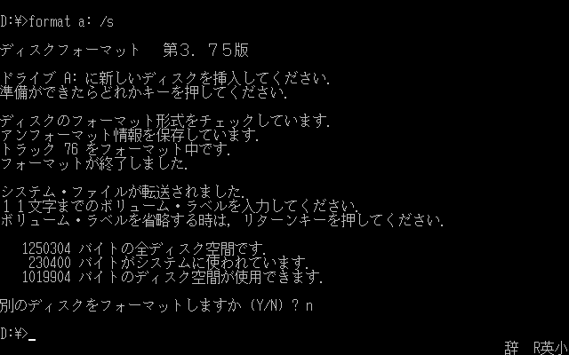
3. Boot from CD-ROM
4. Double click 'コマンドモード (command mode)'
5. Run `Q:\T_FILE\INST_EXT.EXE` with MS-DOS installation path as an argument
   - make sure FD formatted at 2. is in `A:` drive and press any key
   - after finished boot FD creation, press <kbd>⏎</kbd> to reboot from FD
   - 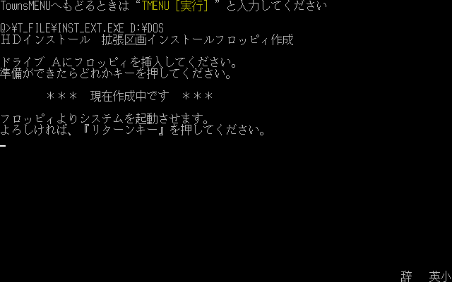
6. TownsMENU starts using FD, HDD and CD-ROM contents automagically

## Install

1. Boot from 'Townsシステムソフトウェア V2.1' CD-ROM or Boot FD
2. Double click 'ツール (tool)', then double click 'HDインストール (HD install)'
3. Select OS to install
   - 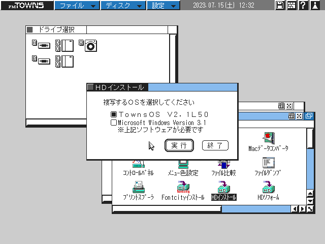
   - select 'TownsOS V2.1' and click '実行 (execute)'
4. Select installation mode
   - 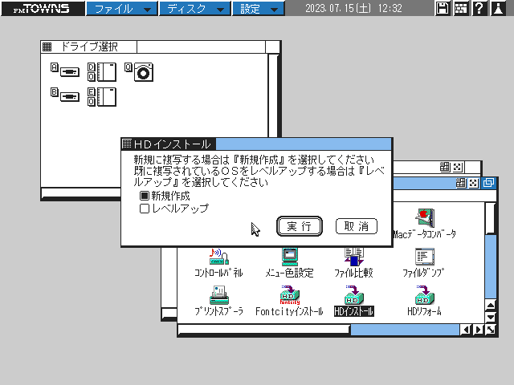
   - select '新規作成 (newly install)' and click '実行 (execute)'
5. Select installation destination
   - 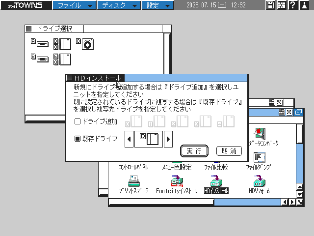
   - select '既存ドライブ (existing drive)' and choose MS-DOS 6 boot partition, then click '実行 (execute)'
6. Confirmation about install over MS-DOS6
   - 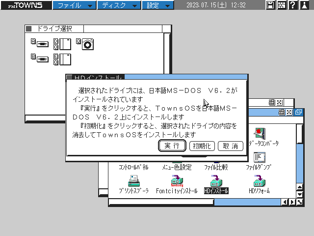
   - click '実行 (execute)'
7. Choose components
   - 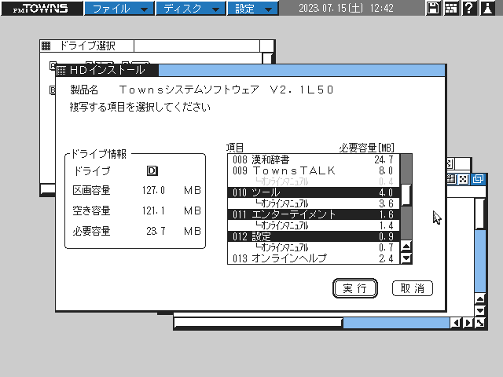
   - scroll down the list view and select 'ツール (tool)', 'エンターテイメント (entertainment)' and '設定 (setting)'
   - click '実行 (execute)'
8. Confirm installation
   - 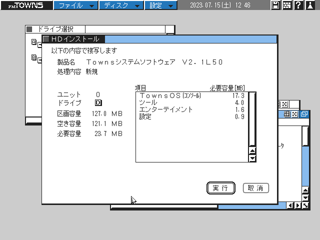
   - click '実行 (execute)'
9. Installation
   - Progress bar will be shown
10. Post-install configuration
   - Page 1
      - 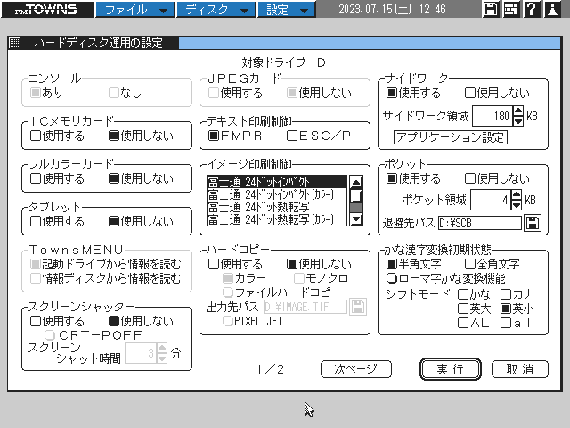
      - click '次ページ (next page)'
   - Page 2
      - 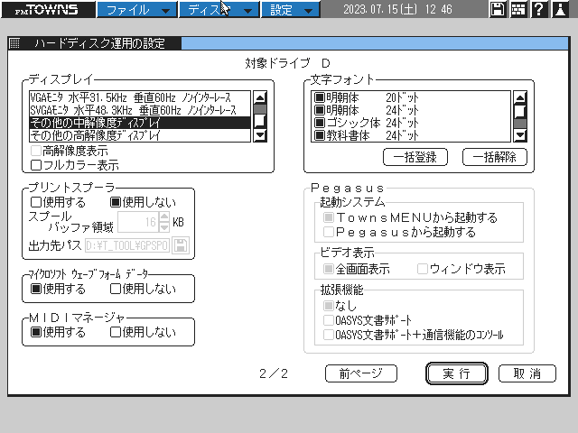
      - *(optional)* if your TOWNS is one of MA, MX, HA, HB and HC and your monitor supports XGA (1024x768), select 'その他の高解像度ディスプレイ (other high-resolution display)' in 'ディスプレイ (display)' list and check '高解像度表示 (high-reoslution output)'
      - click '実行 (execute)'
   - Confirmation Dialog
      - 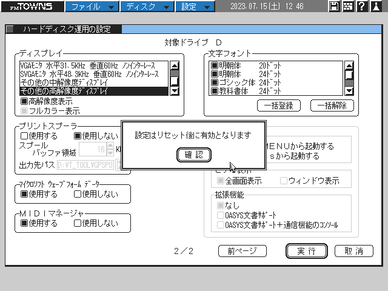
      - the dialog says changes take effect after reboot
      - click '確認 (confirm)'
11. Finish
   - 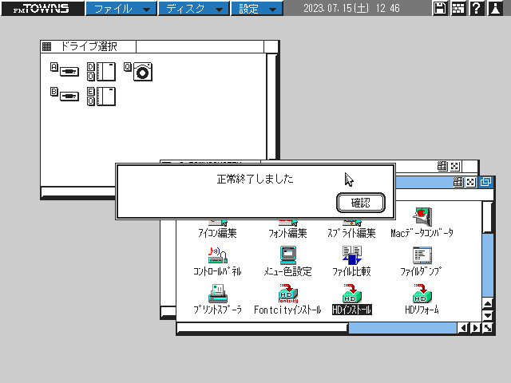
   - installation finished
   - click '確認 (confirm)'
12. Reboot
   - eject CD-ROM and reboot from HDD
   - TownsMENU starts automatically
   - 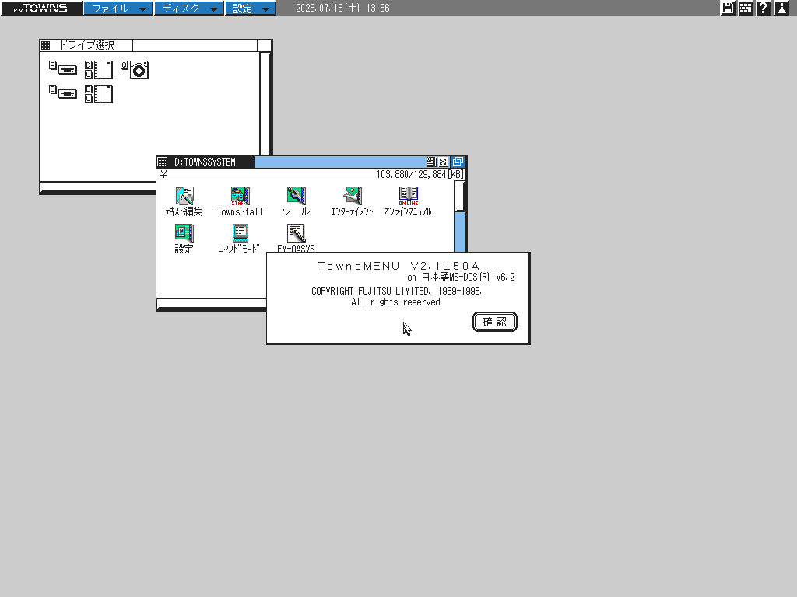

## CLI-GUI switching

### GUI to CLI

- Double click 'コマンドモード (command mode)' to exit TownsMENU

### CLI to GUI

- Execute `TMENU.BAT` to start TownsMENU

## Additional Configuration

### EMS

DOS6's `EMM386.EXE` can use only 15264KB of XMS as EMS.
But newer version of `EMM386.EXE` installed with TownsOS can use whole XMS as EMS.

- Run `SETUP2.EXE` on CLI and select '拡張/増設メモリ (extended/expanded memory)'
- Select '拡張メモリ (EMS) (expanded memory (EMS))'
   - select 'EMSを使用しない (do not use EMS)'
   - 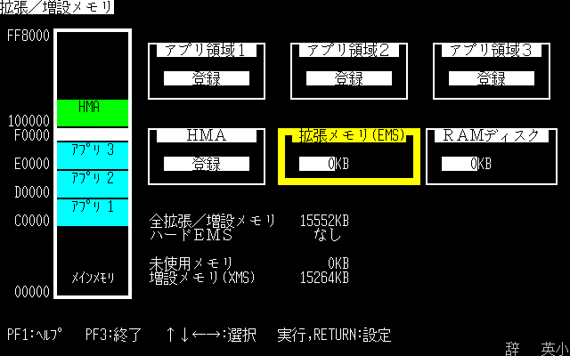
   - Save and Exit, then reboot
   - 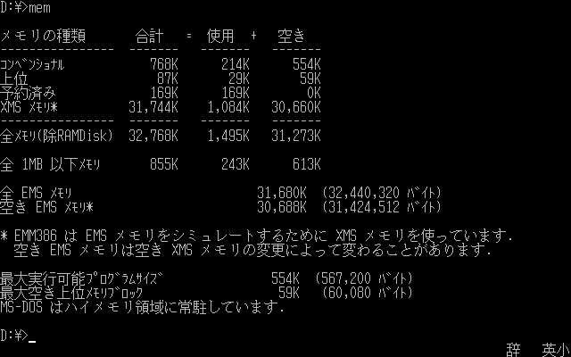
